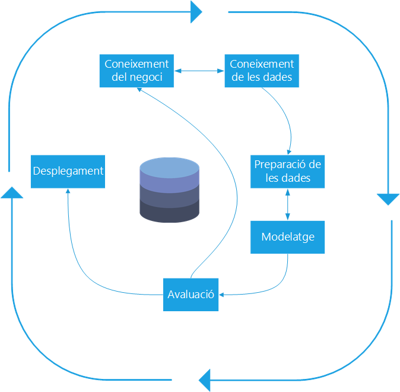

---
output:
  word_document:
    highlight: zenburn
    reference_docx: word-styles-reference-41.docx
  pdf_document: default
---

```{r setup, include=FALSE}
knitr::opts_chunk$set(echo = TRUE)
```


# Format d´entrega 


La documentació generada en la realització de la prova d´avaluació continuada  es troba allotjada en __GitHub__ al següent repositori:

* https://github.com/rsanchezs/data-cleaning

En aquest repositori es poden trobar els següents fitxers:

* Aquest document en formats __pdf__ i __docx__ amb el nom rsanchezs_PAC2.
* Tots els documents, gràfics, imatges i taules utilitzades en aquest PAC.


{width=100%}


# Exercici 1

Després de llegir el recurs “Clean Data”, contesta les següents preguntes amb les
teves pròpies paraules.

1. Quines són les principals etapes d'un projecte analític en ciència de dades?.
Descriu amb les teves paraules cadascuna de les etapes. Aquest procés ha de
realitzar-se una sola vegada o per contra és un procés iteratiu? (màxim 250
paraules).


Tot seguit es mostra una figura amb la qual ens proposem exposar les diferents etapes d´un projecte analític.


Com es pot apreciar un projecte analític no és un procés que es dugui a terme en una sola fase i generalment s´ha de passar per diverses fases.

Aquestes fases són: entendre i expressar un objectiu, entendre les dades amb les que treballarem, preparació de les dades, modelatge, avaluació i desplegament. Convé fer ressaltar que, aquest procés no és lineal, sinó es realimenta i continua.

{width=100%}


A continuació amb la següent taula es detallen les activitats que li corresponen a cada fase:

{width=20%}


2. Suposa que es desitja transferir un grup arxius entre una empresa A i una altra
empresa B. La primera treballa amb OSX i Linux com a sistema operatiu,
mentre que la segona treballa amb Windows. Quin programa de compressió
utilitzaria per a aquesta transmissió i per què? (màxim 100 paraules).


En primer lloc, convé fer ressaltar que quan es realitza una compressió d´un arxiu cal tindre en compte els següents factors:

* La velocitat de compressió i descompressió.
* El rati de compressió.
* La interoperabilitat de la solució de compressió.
* Escollir el software de compressió:
  + `Zip`
  + `gzip`
  + `bzip2`
  + `RAR`

En la següent taula es mostren les diferents opcions:

|  | Velocitat |Rati  |Interoperabilitat  |
|:-:|:-:|:-:|:-:|
|  `gzip`| Ràpida | Normal | Linux i OSX |
| `bzip2` | Lenta  | Petit | Linux i OSX  |
|`zip`  | Normal | Alt | Linux, OSX i Windows |
| `RAR` | Lenta | Normal   | Windows |

> Com es pot apreciar en la taula la millor opció sería realitzar la compressió amb __zip__.

3. Explica amb les teves pròpies paraules, quina és la diferència entre els zeros, les dades buides i les dades nul·les?. Amb l'ajuda d'un exemple real on existeix una pèrdua de dades, explica quan han de col·locar-se zeros i quan aquestes
dades es deixaran com a dades buides durant el procés de data cleaning (màxim 200 paraules).

#### Zeros

El valor zero es representa mitjançant el símbol __0__. Es tracta de un quantitat mesurable i que té un significat en un sistema numèric. Utilitzem zero quan ens referim a valors de tipus numèric. 

#### Dades buides

Podem trobar-nos amb dades buides quan no es coneix el valor per aquest atribut. Ens podem trobar amb els diferents tipus:

* **Cadenes de caracters**: s´utilitza la cadena "Desconegut" o no aplicable `NA`.

* **Dades numériques**: com hem vist en l´apartat anterior s´utilitza el valor 0.

* **Data**: les dades que representen dates i que no coneixem es poden representar mitjançant  una data llunyana (1900-01-01) o primerenca (9999-12-31) en el temps.


#### Dades nul.les

Les dades nul.les es representen mitjançant la paraula reservada `NULL` i ens indica que no existeix informació en un camp.

Aquesta falta d´informació pot venir o bé perquè no es aplicable o bé pel desconeixement del valor.

#### Exemple

A continuació, amb l´ajuda del conjunt de dades `diabetes` veurem com tractar els valors desconeguts:


```{r warning=FALSE, message=FALSE}
# Importem el conjunt de dades
library(readr)
diabetes <- read_csv("../PAC2/data/diabetes.csv")
```

Realitzem un primer contacte amb el joc de dades, visualitzant la seva estructura i els 6 primers registres:

```{r}
# Visualitzem les 6 primeres files
head(diabetes)
```

Amb la següent instrucció podem comprovar el nombre de valors desconeguts per a cada atribut:

```{r}
# Comprobació de valors desconeguts
sapply(diabetes, function(x) sum(is.na(x)))
```


Podem observar que, per a onze observacions, el camp `Pregnacies` no té cap valor assignat. Això podria ocórrer per diversos motius:

* El mes senzill és que no s'hagi pogut obtenir aquesta informació, i en aquest cas podríem o bé
emplenar aquests casos amb el valor més freqüent, o bé amb el valor mitjà.

* També podria ser que l'absència de valor
per al camp embarassos ens indiques  que aquestes files corresponen a pacients masculins, pels quals
el camp no té sentit.


En qualsevol d'aquests dos casos, hauríem de transformar el conjunt de dades. En el primer supòsit, afegint un valor per defecte que fos raonable:

```{r eval=FALSE}
# Mitjançant una condició lógica obtenim els valors desconeguts
missing_values_pregnacies <- is.na(diabetes$Pregnancies)
# Reemplacem els valors desconeguts amb 0
diabetes$Pregnancies[missing_values_pregnacies] <- 0
```


En el segon, creant un nou camp que contingui informació sobre si el pacient és un home o no.

```{r message=FALSE}
# Carreguem les llibreries 
library(tidyverse)
# Creem una nova columna amb el gènere
diabetes <- diabetes %>% 
          mutate(Gender = ifelse(is.na(diabetes$Pregnancies), "Male", "Female"))     
```

Amb el següent diagrama podem comprovar la distribució de la nova variable `Gender`:

```{r dpi=300}
# Visualitzem la distribució de la variable
diabetes %>% ggplot(aes(Gender)) +
  geom_bar(aes(fill = Gender)) +
  theme_minimal()
```


# Exercici 2

Després de llegir el recurs “Data Mining: concepts and techniques” contesta les següents preguntes.

1. Explica amb les teves pròpies paraules quines són les principals etapes del pre-processament de dades (màxim 400 paraules). Posa un exemple d’un projecte analític i indica a grans trets que s’hauria de fer en cada etapa.

Considerem un escenari en el qual un venedor té registres web (logs) corresponents a l´accés dels clients a les pàgines web de la seva tenda en línia. Cada una d´aquestes pàgines web corresponen a un producte, per tant, l´accés d´un client a una pàgina ens pot indicar l´ interès en aquest producte per part del client en particular. El minorista també emmagatzema els perfils demogràfics per als diferents clients. El minorista desitja fer recomanacions de productes als clients utilitzant les dades demogràfiques i el comportament de l´usuari.

En aquest cas, el primer pas per és recollir e __integrar les dades__ rellevants de dues fonts diferents. La primera font és el conjunt de registres web en la tenda en línia. El segon és la informació demogràfica dins de la base de dades del venedor que va ser recollida durant el registre web del client. Desafortunadament, aquests conjunts de dades estan en un format molt diferent i no es poden utilitzar junts per al processament. Per exemple, considerem una entrada de registre de mostra de la següent forma:


```{}
98.206.207.157 - - [31/Jul/2013:18:09:38 -0700] "GET /productA.htm HTTP/1.1" 200 328177 "-" "Mozilla/5.0 (Mac OS X) AppleWebKit/536.26 (KHTML, like Gecko) Version/6.0 Mobile/10B329 Safari/8536.25"
"retailer.net"

```


El registre pot contenir centenars de milers d´aquestes entrades. Per exemple, un client amb l'adreça IP 98.206.207.157 ha accedit a `productA.htm`. El client de l'adreça IP pot ser identificat utilitzant la informació d'inici de sessió anterior, utilitzant cookies o la mateixa adreça IP, però això pot ser un procés escabrós i no sempre pot produir resultats precisos. 

L'analista necessitarà  preparar les dades decidint com filtrar les diferents entrades del registre i utilitzar només aquells que proporcionen resultats precisos com a part de la tasca de __neteja i reducció de la dimensionalitat__.

A més, el registre sense processar conté una gran quantitat d'informació addicional que no és necessàriament valuosa per a l´ús del venedor. En el procés de __transformació de les dades__, es decideix crear un registre per a cada client, amb una selecció específica d´atributs extrets dels accessos a la pàgina web. 

Per a cada registre, un atribut correspon al nombre d'accessos a cada descripció del producte. Per tant, els registres han de processar-se i els accessos han de ser agregats com a part de les tasques de __transformació de les dades__.

Així doncs, els atributs es fusionen als registres de la base de dades del venedor que conté informació demogràfica dels clients. Els valors que falten dels registres demogràfics han d'estimar-se per a una major neteja de les dades. Això dona com a resultat un únic conjunt de dades que conté atributs per a les dades demogràfiques del client i accessos de clients.


2. Explica breument amb les teves pròpies paraules, tres dels factors que poden influir en l’estimació de la qualitat de les dades (màxim 100 paraules).

Seguint amb el nostre exemple, aquest escenari il·lustra tres dels factors que poden influir en l´estimació de la qualitat de les dades: __precisió__, __completud__ i la __consistència__. 

Existeixen multitud de raons per la imprecisió a les dades, per exemple:

* Els instruments/eines emprats per a recollir les dades poden fallar.
* Errors en l´entrada de les dades causades tant per l´usuari com per l´ordinador.
* L´usuari pot introduir informació errònia deliberadament, conegut com _disguised missing_.
* Limitacions tecnològiques com per exemple la mida del _buffer_ en la transmissió de les dades.
* Inconsistència en la convenció en el nom dels atributs, codis, dades de tipus data, etc.


Les dades incompletes poden ocórrer per diverses raons, un bon exemple d´això és que:

* Els atributs d'interès no poden estar sempre disponible, com la informació de clients per a dades de transaccions de vendes. 
* Altres dades no es poden incloure simplement perquè no es consideraven importants al moment d'entrada. 
* Les dades pertinents no poden registrar-se a causa d'un malentès o per avaries de l'equip.

Per últim, com a mostra de la inconsistència en les dades podem posar els següents exemples:

* Que s'hagin eliminat les dades que eren inconsistents amb altres dades registrades. 
* L´enregistrament de l´historial de dades o modificacions pot no haver-se gravat. 


# Exercici 3

Després de llegir el recurs “Data Cleaning Basics”, contesta les següents preguntes:

1. Què es considera un extrem score ? Quins són els seus possibles efectes en
els resultats finals? (màxim 150 paraules).

2. Explica dues possibles causes que poden donar lloc a l’aparició d’extrem
scores i proposa una possible solució juntament amb un breu exemple pràctic
per a cada cas (màxim 200 paraules).


# Bibliografia


[1]:Megan Squire (2015). Clean Data . Packt Publishing Ltd. Capítols 1 i 2.

[2]:Jiawei Han, Micheine Kamber, Jian Pei (2012). Data mining: concepts and techniques . Morgan Kaufmann. Capítol 3.

[3]:Jason W. Osborne (2010). Data Cleaning Basics: Best Practices in Dealing with Extreme Scores. Newborn and Infant Nursing Reviews; 10 (1): pp. 1527-3369 .


